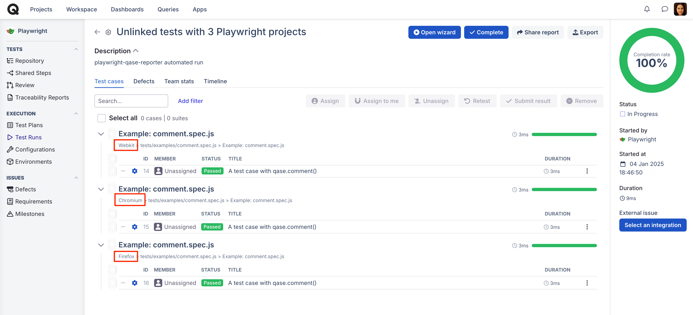
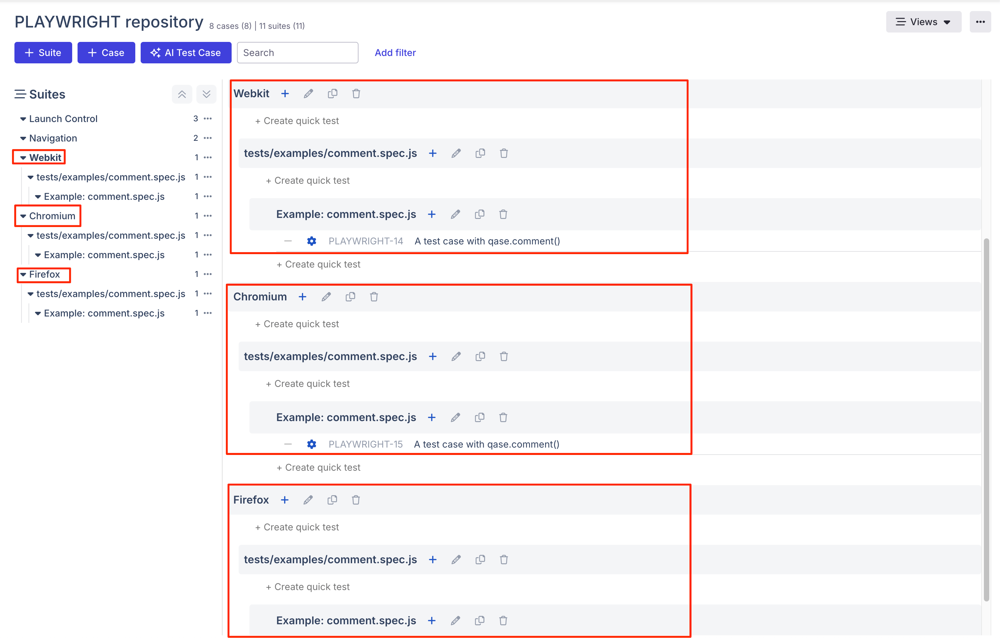

## Problem:
When using Playwright projects to run tests across various browsers the results are arranged under separate suites named after each project. For example, if your projects are defined for three browsers — Chrome, Edge, and Safari. 

When your tests are -

1. **Not linked with Qase Id**: Three different suites will be created, one for each browser.

2. **Linked with Qase Id**: Although results are posted against the same testcase which is linked, they appear as retries. There's no way to find out which result corresponds to which project.

## Cause:

### What are Projects in Playwright?

[A Playwright project](https://playwright.dev/docs/test-projects#introduction) is a group of tests with the same configuration, allowing you to run tests on different browsers and devices. Projects are defined in the [playwright.config.ts](https://github.com/cskmnrpt/qase-playwright/blob/playwright-projects/playwright.config.js) file, and you can run tests on all projects or select a specific one.

Projects also let you run the same tests under different configurations (e.g., logged-in and logged-out states) and customize execution, such as different timeouts, retries, or environments (staging, production), and organize tests by package or functionality.

The ___most common use___ of projects in Playwright is to run tests across multiple browsers and devices with different configurations. Tests are usually configured to run on various browsers like Chrome, Firefox, and WebKit (Safari).

### Why are duplicate cases created?

Playwright runs each test once per each project, therefore there will be multiple results for each test. The `qase-playwright` reporter differentiates each result by nesting it in a suite named after the project.

If the Qase ID is specified in the test, Qase ignores the test and suite titles when assigning the result. The result is always linked to the corresponding test case in Qase, regardless of its name or suite. As a result, all results for that specific test are posted to the same test case and appear as retries.

## Solution?

With the current implementation, the only way to avoid duplicates is by linking your test cases with a Qase ID. However, this causes all results to appear as retries, making it unclear which result corresponds to which project. Currently, there's no way to work around this problem.
